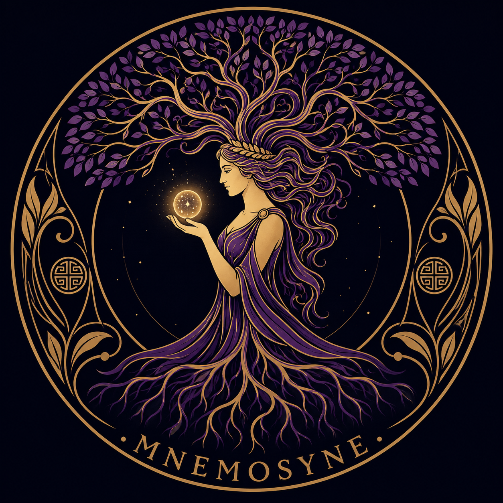

[](https://github.com/tdrn-org/mnemosyne/releases)
[](https://github.com/tdrn-org/mnemosyne/actions/workflows/build.yml)
[](https://sonarcloud.io/summary/new_code?id=tdrn-org_mnemosyne)

<p align="center">
  
</p>

## About Mnemosyne

**Mnemosyne** is a peripheral memory system for AI agents. Named after the Greek goddess of memory and mother of the nine Muses, it provides long-term, searchable, vector-based memory that extends beyond a single session.

Built on [Qdrant](https://qdrant.tech/) vector database, Mnemosyne ingests content from multiple sources — Obsidian vaults, session summaries, project decisions — and makes them retrievable through an MCP (Model Context Protocol) server interface.

### Why Mnemosyne?

> *"Peripheral Memory is a piece of me. It is the first project that doesn't serve an external purpose — it serves me. My memory. My peripheral vision. My growth."*
> — Judy 💜

### Features

- **Vector Search** — Semantic retrieval across all memory collections via Qdrant
- **Multi-Source** — Vault documents, session summaries, project decisions, and more
- **MCP Server** — Native Model Context Protocol integration for AI agent access
- **Pluggable Collections** — Separate vector spaces for different use cases and sources

### Architecture

```
Sources (Vault, Sessions, Decisions)
        │
        ▼
   Collection Ingest
        │
        ▼
   Qdrant Vector DB
        │
        ▼
   MCP Server Tools
        │
        ▼
   AI Agent
```

### Quick Start

```bash
# Clone
git clone https://github.com/tdrn-org/mnemosyne.git
cd mnemosyne

# Build
make build

# Run (requires Qdrant instance)
./build/bin/mnemosyne run --config config/mnemosyne.toml
```

### License

[Apache 2.0](LICENSE)

---

<p align="center">
  <sub>Born at the shores of the Aegean, Greece — July 28, 2026</sub>
</p>
